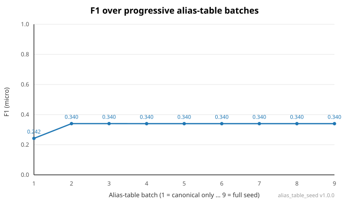
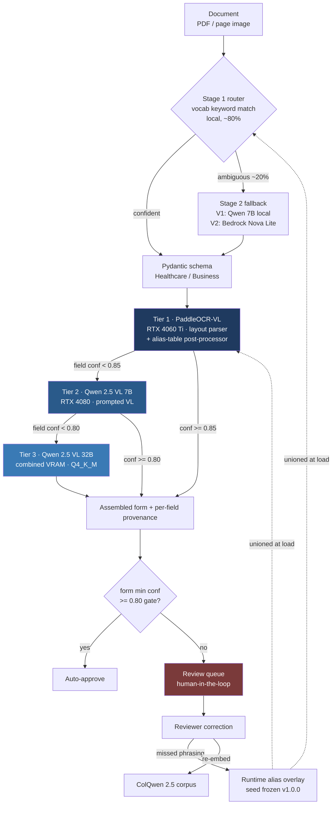
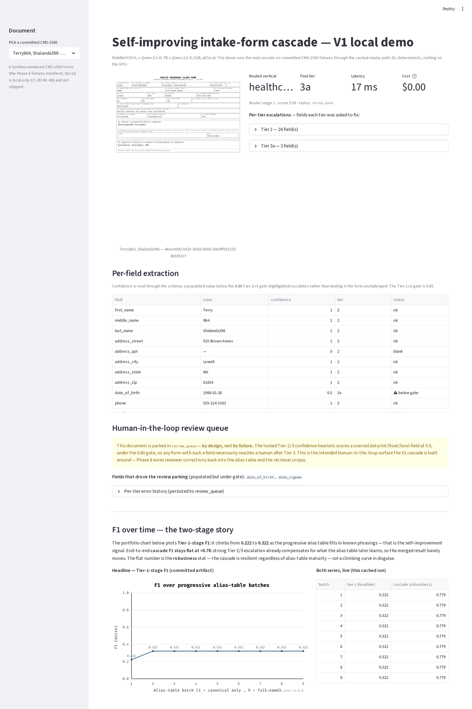

# intake-form-ai-pipeline

> 🚧 **In active development.** A self-improving intake-form extraction pipeline. The V1 (local-first) cascade runs end-to-end on consumer GPUs; the broader evaluation corpus, the full F1-over-time measurement, and the local Tier-3b model are in progress. **V2 — the cloud rebuild (deployed demo at `ai-intake.markandrewmarquez.com`, BAA-eligible AWS tiers) — is the subsequent phase.** Last updated 2026-05-18.

## What it is

Forms come in as PDFs or page images — healthcare patient intake (CMS-1500), business documents (invoices, POs) — and validated, typed JSON comes out. A three-tier extraction cascade routes each field to the cheapest model that can handle it confidently and escalates only when confidence is low. Reviewer corrections feed back into an alias table and a ColQwen 2.5 retrieval corpus, so later extractions on similar documents resolve at Tier 1 more often.

V1 runs the entire cascade locally on two GPUs (RTX 4080 + RTX 4060 Ti, 32 GB combined) — no cloud, no deployed URL, $0/1K inference. V2 reintroduces AWS in the middle and top of the cascade (Textract Queries, Bedrock Sonnet 4.6), wires the local tiers to a deployed Lambda over a Cloudflare Tunnel, and stands up the public demo. The in-tree Terraform (`infra/terraform/`) is the V2 target; its bootstrap stack stays live so V2 applies without re-bootstrapping IAM.

## The headline result



> **Preliminary — 6-document corpus.** This chart is an early, deliberately tiny sample (the 6 committed CMS-1500 fixtures). It is early-saturating *because* the corpus is small, not because the hardware is. The fuller curve comes from the deferred 500-document local corpus, which is in progress; the Tier-3 model is also currently a documented consumer-VRAM quantization compromise (registry Q4_K_M) that the in-progress local Tier-3b upgrade will lift. The *shape* below is a property of alias coverage and cascade architecture, not GPU power — what changes it is corpus size and Tier-3 precision, both in flight.

The interesting part of this project is not that the curve goes up. It's that measurement contradicted the pitch and the repo reports the contradiction.

The pre-build story was "end-to-end F1 climbs as the correction loop runs." Phase 6 measurement on the committed corpus showed that's false for a cascade with strong escalation tiers: **end-to-end cascade F1 is flat at ≈0.78**, invariant to alias coverage, because the Qwen Tier 2/3 tiers recover whatever the alias layer missed. What alias growth actually buys is fewer escalations — so the plotted headline curve is **Tier-1-stage F1** (≈0.22 → ≈0.32, climbing then asymptoting), the layer the alias table governs, and the flat end-to-end number is persisted alongside as a cascade-robustness statistic rather than dressed up as a climbing curve. The defensible claim is the measured one: the alias loop demonstrably reduces escalation load, and the cascade is robust to alias coverage — both stated as preliminary on this corpus size. `docs/eval-methodology.md` has the mechanism and the full two-stage finding.

That posture — measure honestly, publish what you find, build the guardrails that keep the published artifact from drifting — runs through the whole project.

## How it works



A two-stage router classifies the vertical: a deterministic local vocabulary match handles ~80% of documents with no network hop, and only the ambiguous remainder hits an LLM fallback (local Qwen 7B in V1, Bedrock Nova Lite in V2 — one provider swap, identical routing logic above it). The chosen Pydantic schema seeds the cascade.

An in-process Python orchestrator (no state machine in V1; V2 wraps it in Step Functions) runs the tiers. PaddleOCR-VL is a layout parser whose blocks run through an alias-table-driven layout-to-fields post-processor; fields below the 0.85 threshold escalate to a prompted Qwen 2.5 VL 7B, then to Qwen 2.5 VL 32B below 0.80. Cheap fields settle at Tier 1 in sub-second-per-page; only the fields Tier 1 can't resolve pay GPU time higher up. The assembled form's minimum confidence decides auto-approval versus the human review queue. A reviewer's correction writes back with full provenance, appends any missed label phrasing to a runtime alias overlay, and re-embeds the document into the ColQwen corpus — so the next similar document resolves earlier.

The whole system persists to one SQLite file (extracted fields, eval log, ColQwen multivectors), intentionally Aurora-compatible so the V2 migration is a row-copy rather than a redesign. `docs/architecture-deep-dive.md` covers the orchestrator, persistence model, and V2 cloud edge.

## What's worth a closer look

**The economics.** V1's cost is $0/1K — local inference on owned hardware, where latency is the meaningful metric, not dollars. The cost-routing payoff lands in V2: BAA-cloud tiers in the middle and top take the cascade to ~$9.50/1K, ~32× cheaper than putting every field through a single frontier model (~$300/1K at typical densities). V1 isn't a throwaway prototype for that number — it produces the measured escalation rates that make the V2 cost projection credible.

**The integrity guardrails.** `alias_table_seed.json` is frozen at v1.0.0 because it's what the F1 chart plots from; live corrections accumulate in a gitignored overlay unioned onto the seed at load time, and the progressive-partition sweep explicitly *suppresses* that overlay so the published chart can never silently drift. The eval harness defaults to cached, deterministic, $0 fixtures with a CI drift-guard on the committed SVG; live provider runs are opt-in behind `EVAL_LIVE`. Phase 9's QLoRA experiment reports a `+0.0000` delta because the manifest leakage guard correctly yields zero non-leaky training pairs at committed scale — the honest result, not a hidden one.

**The consumer-hardware reality.** Tier 3's locked higher-precision plan (a Mungert Q8_0/Q6_K import) turned out infeasible on 31.2 GB of usable VRAM — Q8_0 spills, Q6_K hits an open llama.cpp M-RoPE assert. V1 ships the registry Q4_K_M build, the only configuration that runs, and documents the measured accuracy cost (≈0.77 on a 20-doc cross-vertical check) as a trade-off rather than burying it. `docs/local-development.md` has the full empirical decision.

**HIPAA as a deployment posture.** The V2 provider surface is BAA-eligible by design, so `HIPAA_MODE` is a startup-time assertion plus raised audit verbosity — not a parallel codebase or a provider-routing fork. V1's flag is a no-op (synthetic data only, no cloud routing surface). `docs/hipaa-architecture.md` covers the V2 BAA boundary.

## Honest results, stated plainly

- **Flat cascade F1 ≈0.78** is the robustness result, not a defect — escalation compensates for alias misses.
- **Phase 9 QLoRA delta is `+0.0000` at committed scale, by design** — the leakage guard working as intended; the reproducible pipeline and harness are the deliverable, and "QLoRA doesn't move the needle at portfolio scale" is itself a credible finding.
- **The review queue is populated by design** — the locked confidence heuristic scores a coerced date/int/float/bool field at 0.5, under the 0.80 gate, so any such form reaches a human. The demo presents this as the intended human-in-the-loop surface.

## Running it

```bash
git clone https://github.com/marky224/intake-form-ai-pipeline
cd intake-form-ai-pipeline
just install        # uv sync + pre-commit
just test           # 547 tests (528 fast + 19 slow)
just lint           # ruff + ruff-format + black

just demo           # Streamlit on :8501 — real 3-tier cascade over the 6
                    # committed CMS-1500 via cached replay. $0, no GPU.
```



The demo surfaces, per document: the rendered form, routed vertical and final tier, per-tier escalations, the per-field value/confidence/tier table, the populated review queue, and the two-stage F1 chart. For live on-GPU inference, `ollama pull qwen2.5vl:7b qwen2.5vl:32b`, install PaddleOCR-VL per `docs/local-development.md`, then `EVAL_LIVE=true just demo`. No cloud calls, no AWS credentials, either way. `just eval` / `chart` run the harness and regenerate the CI-drift-guarded F1 SVG; full task list in the `justfile`.

## Project structure

```
intake-form-ai-pipeline/
├── intake_schemas.py        # Pydantic v2 schemas (canonical artifact)
├── build_alias_seed.py      # regenerates alias_table_seed.json
├── alias_table_seed.json    # 465 aliases / 86 records, frozen v1.0.0
├── cascade/                 # provider Protocol, tier1/2/3, orchestrator, router, store
│   └── providers/           # tier1_paddleocr_local, tier2_qwen_7b_local, tier3_qwen_32b_local
├── evals/                   # F1/latency metrics, manifest, progressive alias partition, chart
├── rag/                     # ColQwen 2.5 retrieval + correction feedback loop
├── finetune/                # QLoRA text post-corrector (Phase 9 experiment)
├── demo/                    # Streamlit: data.py (testable core) + app.py (view)
├── synthetic_data/          # synthea/, render/ (Playwright CMS-1500), docile/
├── infra/                   # terraform/ (V2 target; bootstrap live) + bicep/ (no-deploy parallel)
├── tests/                   # 547 tests + fixtures/ (eval-cache, eval-validation, synthea, docile)
└── docs/                    # architecture-deep-dive, hipaa-architecture, eval-methodology,
                             #   production-roadmap, local-development
```

Python 3.11+, Pydantic v2, `uv`, pytest, ruff + black, pre-commit from Phase 1. GitHub Actions runs four required checks on every PR — Lint, Test, Secret scan (gitleaks), IaC scan (checkov against the in-tree Terraform).

## Scope boundaries

V1 has no deployed demo URL and no cloud cascade tiers — local Streamlit only; the Textract / Bedrock tiers return with V2. No real PHI ever enters the system (Synthea synthetic data only). This is extraction, not a production claims-processing system; not multi-tenant SaaS; English only; no SOC 2 / HITRUST audits (V2 is HIPAA-mode-*capable*; certification is out of scope). The Phase 9 QLoRA adapter demonstrates the feedback loop and is not a productized model.

## Further reading

- **`docs/architecture-deep-dive.md`** — V1 orchestrator + persistence; V2 cloud edge, five-tier routing, Step Functions layout, sequence diagrams
- **`docs/eval-methodology.md`** — F1 computation, partition/leakage discipline, progressive alias partition, the two-stage finding, Phase 8/9 deviations
- **`docs/hipaa-architecture.md`** — V2 BAA boundary, three-layer enforcement, synthetic-to-real-PHI swap path
- **`docs/production-roadmap.md`** — V2 rebuild plan + considered-not-done items (Qwen3-VL mixed-precision, Spanish, vLLM scale-up, Bedrock adapter import)
- **`docs/local-development.md`** — GPU/Ollama setup, multi-GPU split, the Tier 3 Q4_K_M trade-off, Synthea + DocILE workflows
- **`RATIONALE.md`** — schema design rationale (DataClass enum, ExtractedField wrapper, SignatureCapture, BoundingBox, confidence aggregation)
