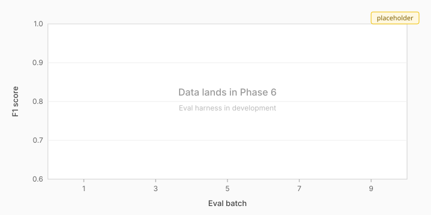

# intake-form-ai-pipeline

> 🚧 **In active development.** Phase 2 of 10 (in progress). Last updated 2026-05-10.

## What this is

A self-improving intake-form processing pipeline. Forms — healthcare patient intake, business invoices, contracts — come in as PDFs or page images; structured fields come out as validated JSON. A three-tier extraction cascade routes each field to the cheapest model that can confidently handle it, escalating to more capable models only when confidence is low. Reviewer corrections feed back into the alias table and a ColQwen 2.5 retrieval corpus, so subsequent extractions on similar documents land Tier 1 more often. F1 trends upward as corrections accumulate; cost per document trends downward.

## Headline metric: F1-over-time

<!-- F1 chart placeholder lives at docs/assets/f1-placeholder.svg until Phase 6 produces real eval data. Replace the image source with the live chart in Phase 10 polish. -->



The chart updates as eval batches run. Phase 6 produces the first real points; until then this is a placeholder.

## Live demo

*[ai-intake.markandrewmarquez.com](https://ai-intake.markandrewmarquez.com)* — *placeholder served by CloudFront as of Phase 2. Phase 7 swaps the bucket contents for the React review UI.*

The current page is a static placeholder so the production edge can stabilize before any application code lands behind it. CloudFront fronts an S3-origin landing bucket via Origin Access Control (signing CloudFront → S3 requests with SigV4), AWS WAF v2 enforces a per-IP rate limit (100 req / 5 min) plus a User-Agent block list and three AWS-managed rule groups, the AWS-managed `SecurityHeadersPolicy` adds HSTS / `X-Content-Type-Options` / `X-Frame-Options` / `Referrer-Policy` / `X-XSS-Protection` to every response, and access logs deliver to S3 via the v2 CloudWatch Logs Delivery primitives (`DeliverySource → DeliveryDestination → Delivery`) for downstream Athena querying.

Phase 7 swaps the placeholder for a wake-on-request flow: Aurora Serverless v2 wakes on request (~30-90 second cold start), the page shows the project pitch and current F1-over-time chart while it warms, then auto-redirects to the React review UI with three pre-loaded documents waiting. Live cost telemetry on every page — every session shows the actual inference cost incurred, pulled from the database. Most sessions cost less than $0.05.

## Architecture overview

<!-- ARCHITECTURE_DIAGRAM: real diagram (likely Excalidraw export) lands in Phase 10 polish. Prose description below stands in for now. -->

A document arrives at the S3 upload bucket. A two-stage classifier — vocabulary keyword match locally, Bedrock Nova Lite fallback for ambiguous documents — determines vertical (healthcare or business document) and form type. The classification picks the right Pydantic schema and seeds the cascade.

Step Functions orchestrates the cascade: a Tier 1 extraction with PaddleOCR-VL (local on the RTX 4060 Ti, exposed to the deployed demo via a Cloudflare Tunnel bridge to the home GPU), per-field confidence scoring against thresholds, then conditional escalation to Tier 2 (AWS Textract Regular Queries), Tier 3a (Qwen 2.5 VL 32B, local on combined RTX 4080 + RTX 4060 Ti via the same bridge), and Tier 3b (Bedrock Claude Sonnet 4.6) for hard cases. Per-field thresholds at 0.85 / 0.80 / 0.75 govern escalation; ~90% of fields never leave Tier 1.

Extracted fields are stored in Aurora Serverless v2 alongside the alias table and pgvector embeddings. The React review UI fetches low-confidence fields for human review; reviewer corrections write back to Aurora, update the alias table, and append to the ColQwen 2.5 retrieval corpus. The eval harness reads from a partitioned manifest (train/dev/test), computes F1, cost-per-document, and latency p50/p99, and publishes the F1-over-time chart that's the project's headline metric.

## How it works

A concrete example. A patient intake form arrives — a scanned CMS-1500 with mostly typed fields and one handwritten signature.

**Stage 1: classification.** The vocabulary classifier scans the OCR text from the first page for healthcare-specific terms. Hits on "Patient ID," "MRN," "HIPAA," "Member ID" — confident healthcare classification, no need for the Nova Lite fallback. The router picks `HealthcareIntakeForm`. Total time: ~50 ms. Cost: $0.

**Stage 2: Tier 1 extraction.** PaddleOCR-VL processes the page image and returns field-level extractions with bounding boxes and per-field confidence. First name 0.97. Last name 0.95. DOB 0.88. Phone 0.92. SSN 0.79. Most fields clear the 0.85 threshold and land Tier 1. SSN doesn't.

**Stage 3: per-field escalation.** SSN escalates to Tier 2 (Textract Regular Queries). Textract's "What is the patient's social security number?" query against the SSN region returns "123-45-6789" at 0.93. Above threshold. Done.

**Stage 4: confidence aggregation.** `compute_form_confidence` walks the populated fields and returns min/mean/blank/unattempted counts. Min 0.88 (DOB), mean 0.93. Form-level confidence is good; the form goes to the auto-approval queue, not the review queue.

A second example. A multi-page commercial invoice arrives with three line items in a poorly-aligned table. Tier 1 extracts header fields confidently but the table escalates to Tier 3a (Qwen 2.5 VL — vision-capable, handles spatial layout). Qwen returns the line items at 0.82 confidence. Above the Tier 3a threshold (0.75). Done. The form's min confidence is 0.82 — borderline. It goes to the review queue with low-confidence fields highlighted.

This is what cost-routing by capability buys you: ~90% of fields stay at Tier 1 (local, near-zero per-call cost beyond hardware amortization); the few hard fields pay the cloud Tier 2 + Tier 3b cost. Single-model approaches at Bedrock Sonnet pricing would cost ~$300 per 1,000 documents at typical field densities; the cascade lands at ~$9.50.

## Self-improvement mechanism

When a reviewer corrects a field, three things happen. First, the corrected value is written back to Aurora with full provenance — which tier produced the wrong answer, which other fields were also incorrect on the same form, the corrected value, the reviewer's session ID. Second, if a previously-unseen label phrasing was encountered, the correction handler appends it to the alias table keyed on `(canonical_name, vertical, alias_text)`. Third, the corrected document is embedded with ColQwen 2.5 and appended to the retrieval corpus.

Subsequent extractions on similar documents benefit two ways. Late-interaction visual retrieval surfaces the corrected document as a few-shot example for Tier 3a/3b prompts, so the LLM has a concrete worked example for the layout it's looking at. And the alias table — joined into the schema-validation step — expands the recognized variant phrasings; what was previously an unrecognized label "Pt. First Nm" now resolves to `first_name` directly, no escalation needed.

The eval harness measures this. F1 over batches, with batches numbered as corrections accumulate. The headline F1-over-time chart is the visible artifact of the loop working. Cost per document trends downward in parallel — cleaner Tier 1 hits mean fewer escalations.

**How the F1-over-time chart works in this demo.** The corrections feeding the loop come from the `alias_table_seed.json` file's accumulated schema-design work, not from live reviewer corrections. Aliases are introduced progressively — batch 1 starts with the canonical phrasing for every field (~18% of the alias set), each subsequent batch adds the next-priority variant per field, batch ~8 has the full set. F1 is measured at each batch. The mechanism is identical to the production reviewer-correction loop; the only difference is that corrections in this demo are seeded from the schema build rather than generated by reviewers in real-time. `docs/eval-methodology.md` walks through the partition strategy.

## Multi-vertical routing

The pipeline supports two production verticals: healthcare (Synthea-rendered CMS-1500-inspired forms) and business documents (DocILE's annotated dataset).

Healthcare and business documents share the same cascade; healthcare documents may contain PHI under HIPAA, which constrains *where the cascade is deployed*, not which providers it uses. The entire provider surface is BAA-eligible by design: local Tier 1 + Tier 3a inference (HIPAA-safe when the host environment is itself HIPAA-compliant), plus AWS BAA-eligible cloud services (Textract Tier 2, Bedrock Sonnet Tier 3b, Bedrock Nova Lite Router Stage 2). No non-BAA cloud provider is in the routing table.

A single config flag (`HIPAA_MODE`) governs deployment posture, not provider selection. When `on`, the routing layer asserts at startup that every configured provider is BAA-eligible (a defense-in-depth no-op under the current architecture; it catches future configuration mistakes), enforces verbose audit logging, and surfaces a deployment-environment checklist the operator must satisfy (physical access controls, encryption at rest/in-transit, workforce HIPAA training, breach response runbook). When `off`, audit logging defaults to standard verbosity. The cascade composition is identical in both modes.

Cost is consequently identical in both modes: **~$9.50 per 1,000 documents** at typical escalation rates. This is estimated from cascade priors; Phase 6 eval will measure actual rates on this corpus and update the figures. `docs/eval-methodology.md` walks through the methodology, and `docs/hipaa-architecture.md` covers the BAA boundary in full.

The classification step is itself the BAA boundary's first line. The vocabulary keyword classifier runs locally and never sends document content over the network. Only the ~20% of inputs that fall through to the LLM stage go to Bedrock Nova Lite, which is BAA-eligible.

## Key engineering decisions

Fifteen choices made deliberately.

### Why three tiers

The pipeline uses three tiers of extraction with progressively more capable (and more expensive) models. Documents start at PaddleOCR-VL — fast, runs locally on the RTX 4060 Ti, near-zero per-call cost beyond hardware amortization. Confidence-borderline fields escalate to Textract Regular Queries, then to Qwen 2.5 VL, and finally to Claude Sonnet 4.6 for the rare hard case. This cost-routes by capability: ~90% of fields never leave Tier 1.

Single-model approaches were rejected on cost. At typical field densities, sending every field to Bedrock Sonnet costs ~$300 per 1,000 documents. The cascade lands at ~$9.50 — a ~32× cost ratio. Tier 3 splits internally into 3a (vision-capable LLMs, Qwen 2.5 VL local) and 3b (strongest LLMs, Claude Sonnet 4.6 via Bedrock) — covered in `docs/architecture-deep-dive.md` for readers who want the full routing detail.

### Why Aurora Serverless v2 with auto-pause

Aurora Serverless v2 with min 0 ACU and auto-pause after 5 minutes idle costs ~$5-10/month at portfolio-scale traffic — most of the day, the database isn't running and isn't billing. Always-on Aurora at the 0.5 ACU minimum bills $0.06/hour ≈ $43/month.

A single Aurora cluster with three schemas (`demo`, `eval`, `staging`) avoids multi-cluster cost while preserving environment isolation. Demo gets reset per visitor session via the `reset_demo` Lambda; eval is the source of truth for F1-over-time numbers; staging is for development work.

The cost of auto-pause is the 30-90 second cold start when a visitor arrives. Mitigated by the wake-on-request landing page, which gives them something to read while Aurora warms.

### Why pgvector for embeddings

The retrieval layer is local-first by design. ColQwen 2.5 runs on the local GPU for embedding generation; only the storage of those embeddings is in the cloud. Pgvector lives inside the same Aurora instance as the operational data — one connection string, one IAM role, one place to debug.

The alias table and the embedding table can JOIN, which matters for the correction feedback loop where corrections need to update both atomically. Pgvector folds into Aurora's $5-10/month cost envelope rather than adding a separate vector-DB line item. And the project's self-improvement story depends on inspecting and updating embeddings as corrections accumulate — straightforward against pgvector, much harder against managed black-box services where chunking strategy is opaque.

### Why DocILE for the business-document vertical

DocILE has 6,680 annotated business documents with a 55-field taxonomy and a free academic license. We use the taxonomy directly to preserve benchmark compatibility — F1 numbers from this project compare cleanly to published baselines without translating between schemas.

Registration at docile.rossum.ai before Phase 4 begins.

### Why Synthea plus local rendering for healthcare

Real CMS-1500 PDF datasets with ground truth don't exist publicly — privacy regulations preclude them. Synthea is the only path to unlimited synthetic patient volume with ground truth you control, and it's free.

Local rendering via HTML+Playwright was chosen over LaTeX, ReportLab, and LibreOffice. CSS gives trivial knobs for the realistic noise the cascade needs to handle: rotation, JPEG artifacts, blur, contrast variation, partial occlusion. Synthetic data includes both typed and handwritten signature variants in roughly a 70/30 split, rendered programmatically via Google Fonts handwriting fonts plus an SVG ink-bleed filter, so the cascade trains against real signature diversity. Total build cost: ~6-8 hours, unlimited rendered forms.

The headline F1-over-time chart depends on this volume. Without synthetic generation at scale, batched eval isn't tractable for a portfolio project budget.

### Why Q8_0 with multi-GPU split (and CPU spill) for local Tier 3a

The local hardware is two consumer GPUs sharing PCIe — RTX 4080 (16 GB) plus RTX 4060 Ti (16 GB), no NVLink. Combined 32 GB VRAM with PCIe-only inter-GPU communication. Qwen 2.5 VL 32B at Q8_0 weighs ~36.3 GB; it doesn't fully fit, but ~4 GB of CPU spill is acceptable when the goal is fixture-generation accuracy over interactive iteration speed. The cascade's batch workflow tolerates the velocity hit — Phase 6 fixture generation against 1000 documents runs overnight either way.

Q8_0 is imported from the `Mungert/Qwen2.5-VL-32B-Instruct-GGUF` Hugging Face repository via custom Ollama Modelfile rather than the official Ollama registry, which only ships Q4_K_M, Q8_0, and FP16 for Qwen 2.5 VL. Q4_K_M (the registry default, ~20.1 GB, validated working May 5, 2026 with 7% CPU spill) is retained as a fast-iteration fallback option — not as the locked Tier 3a default.

Phase 4 begins with a 20-doc dual-quant sanity test pitting Q8_0 against Q6_K (custom Modelfile from the same Hugging Face repo, ~28.7 GB, no CPU spill expected). If F1 is within ±0.02, Q6_K wins by saving the spill. If F1 differs measurably, Q8_0 stays locked. The full contingency tree (including Q4_K_M and InternVL3.5-8B fallback paths) is documented in `docs/local-development.md`.

Production runs Tier 3a on the same local Qwen 2.5 VL 32B model exposed to AWS via a Cloudflare Tunnel bridge to the home GPU (Phase 7). A managed-cloud Tier 3a host (Together AI's 72B, Novita's hosted inference, etc.) was considered and rejected: managed cloud Tier 3a at the project's escalation rate adds ~$15/1K to the cascade cost without a material F1 lift over Qwen 32B local, and routing PHI through a non-BAA managed inference provider would force a HIPAA-mode routing swap the architecture now avoids by design.

### Why HIPAA mode is a deployment posture, not a separate codebase

`HIPAA_MODE=on` is a deployment-posture assertion rather than a provider-routing switch. The cascade's entire provider surface is BAA-eligible by design — local Tier 1 + Tier 3a (HIPAA-safe when the host environment is HIPAA-compliant) plus AWS BAA-eligible Tier 2 (Textract), Tier 3b (Bedrock Sonnet), and Router Stage 2 (Bedrock Nova Lite) — so there's no non-BAA provider for the flag to swap out. What `HIPAA_MODE=on` does: enforce a startup-time assertion that every configured provider is BAA-eligible (defense-in-depth against future misconfiguration), raise audit-logging verbosity, and surface the operator deployment-environment checklist (physical access controls, encryption at rest/in-transit, workforce HIPAA training, breach response runbook).

A separate codebase for healthcare would have meant maintaining two parallel implementations indefinitely. The boundary between "what's PHI" and "what's not" is data-driven (the `DataClass` enum on each field) and routing-aware (the `is_baa_required` helper). Moving that boundary doesn't require changing extraction logic or schemas — only the operator's deployment environment.

The HIPAA-safe deployment posture targets real customers running on-prem inside their HIPAA-compliant infrastructure (hospital data center, HITRUST-certified hosting). The portfolio's deployed demo at `ai-intake.markandrewmarquez.com` operates against Synthea-generated synthetic data only and is documented as a non-HIPAA deployment; HIPAA mode is exercised in tests and documented as a capability, not run live against PHI. Cost is identical in both modes: ~$9.50 per 1,000 documents.

### Why a two-stage router

The router runs in two stages. Stage 1 is a vocabulary keyword classifier that runs locally and handles ~80% of documents with no PHI exposure to any cloud provider. Stage 2 is Bedrock Nova Lite, which handles the ambiguous ~20% that falls through and is BAA-eligible. Total cost ~$0.05 per 1,000 documents.

The vocabulary list seeds from `alias_table_seed.json` — terms that only appear in healthcare contexts (MRN, HIPAA acknowledgment, allergies) become Stage 1 healthcare classifiers. The pattern (vocabulary classifier with LLM fallback) is itself a portfolio-worthy decision: cost-aware, BAA-correct, accuracy-preserving.

### Why cached fixtures by default, opt-in live mode for eval

The eval harness defaults to cached fixtures: per-tier, per-document responses captured once and replayed on subsequent runs. Live mode (`EVAL_LIVE=true`) hits the actual providers. Default-cached saves $125-275 in build budget vs running paid live mode on every iteration; the opt-in switch keeps the live path tested.

Fixtures are versioned per tier and per document, with `evals/fixtures_manifest.json` recording the model versions used. When a provider's model version changes upstream, the manifest mismatch surfaces in CI and a refresh is triggered explicitly.

This separates two questions that often get conflated. "Does the eval logic work?" is answered by cached fixtures with no cloud cost. "Does the cascade still produce the same outputs against current provider versions?" is answered by `EVAL_LIVE=true` runs gated behind the env var. Both questions matter; running them together every time is wasteful.

### Why ColQwen 2.5

ColQwen 2.5 is the current state-of-the-art in late-interaction visual retrieval. It benchmarks ~5 nDCG@5 points higher than predecessor models on ViDoRe, uses fewer patch embeddings (768 vs 1024 — cheaper to store and query at the same accuracy), and ships with permissive Apache 2.0 / MIT licensing. Runs locally on the 4080 alongside the cascade.

### Why bulk batch correction UX, with single-document review as a secondary view

Real intake teams operate as a queue, not as a single-document pipeline. The reviewer is correcting "the bad fields across the next 50 documents," not "every field in this one document." Bulk batch correction surfaces all low-confidence fields across the queue, lets reviewers accept/reject in batches with auto-save to localStorage, and gives the audit trail a clear commit point via an explicit "Submit corrections" save action.

Single-document review is also supported as a secondary view — the reviewer can drill into any document from the batch view to see fields in context. This handles cases where field-level context across the form matters (e.g., subscriber name doesn't match patient name when relationship=self).

The product-design angle: bulk-batch-as-primary plus single-doc-as-drill-down reflects that production review workflows are throughput-driven without sacrificing the precision a reviewer occasionally needs. Both modes read from the same Aurora data, so adding the secondary view costs essentially nothing infrastructure-wise.

### Why wake-on-request over always-on Aurora

Aurora Serverless v2 minimum 0.5 ACU at $0.12/ACU-hour = $0.06/hour running. Always-on for a public demo: ~$43/month. Wake-on-request with auto-pause after 5 min idle: ~$5-10/month total — Aurora wakes ~50 times/month for visitor traffic, each wake bills 10-20 minutes before idle-pause kicks in. Annual savings: ~$400.

The UX cost is the 30-90 second cold start. Mitigated three ways. The wake page shows project pitch and F1-over-time chart during the wait — the visitor gets value immediately rather than staring at a spinner. A DynamoDB single-item lock prevents simultaneous-wake race conditions if multiple visitors arrive in the same minute. An explicit progress indicator confirms the system is working.

The tradeoff: 30-90 seconds of visitor wait time is acceptable for a public demo; $400/year of always-on is not. Production deployment with paying customers would flip this calculus, which is documented in `docs/production-roadmap.md`.

### Why a DataClass enum

`DataClass` is a single enum with values `PUBLIC`, `PII`, `PHI`, and `PCI`. It's forward-extensible — `GLBA`, `FERPA`, `GDPR_PERSONAL` can be added with one enum value plus one routing rule when those regimes enter scope. It enforces correctness at declaration time: a field can't be statutorily inconsistent (e.g., marked PHI but not PII, which violates HIPAA's definitional structure). And the `is_baa_required(meta)` helper becomes a clean enum-set check.

`Sensitivity` is retained as an orthogonal axis (`low`, `medium`, `high`). `data_class` says WHAT regulated data; `sensitivity` says HOW careful within that regime. Both matter for routing — a `PII` field with `sensitivity="high"` (e.g., SSN) routes differently than a `PII` field with `sensitivity="low"` (e.g., a publicly-listed business name).

### Why per-field confidence thresholds at 0.85 / 0.80 / 0.75

Engineering judgment with calibration intent. The values come from PaddleOCR-VL's and Qwen 2.5 VL's empirical confidence ranges on intake-form fields: scores below 0.85 from a vision-OCR model correspond roughly to 70-80% accuracy — the threshold where re-extraction becomes cheaper than human review.

The 0.85 → 0.80 → 0.75 step pattern reflects that each subsequent tier is more capable, so the bar for "this tier's answer is good enough" relaxes accordingly. Tier 1 needs to be confident before we trust it; Tier 3b is the last resort, and a 0.75 from Sonnet is a stronger signal than a 0.75 from PaddleOCR.

These are starting values, not final ones. The Phase 6 eval harness sweeps thresholds across the test corpus to find the Pareto frontier of cost vs F1.

### Why public-on-day-1 (the GitHub repo)

The GitHub repo is public from the first commit, with an "in development" banner and a README skeleton. Visitors discover and bookmark URLs at any phase; a 404 because the repo is private is a worse signal than visible work-in-progress. The public commit history demonstrates real iteration over time — visible work-in-progress beats a single polished commit.

The deployed demo at ai-intake.markandrewmarquez.com is on a different timeline. The DNS and URL are reserved from Phase 1 (visitors bookmark URLs they see, even before they're live), and the production edge (CloudFront + WAF + ACM cert + landing bucket) lands in Phase 2 serving a static placeholder. The cascade behind it doesn't go live until Phase 7, which swaps the bucket contents for the wake-on-request landing page and the React review UI without changing any of the surrounding edge configuration. This avoids both broken-link-on-day-1 (bad signal) and over-promising-on-day-1 (worse signal).

Pre-commit hooks (ruff + black + tests) and GitHub Actions on every PR are configured from Phase 1, which forces commit hygiene and main-branch quality from day 1.

## Getting started

The project is mid-build (Phase 2 of 10). The schema layer is complete and tested; the cascade orchestrator, eval harness, and review UI land in subsequent phases. The two blocks below split what works today from what lands later.

### What works today

```bash
git clone https://github.com/marky224/intake-form-ai-pipeline
cd intake-form-ai-pipeline

just install        # uv sync + pre-commit install
just test           # 40 schema tests against intake_schemas.py
just lint           # ruff check + ruff format check + black check
just format         # auto-fix
just alias-seed     # regenerate alias_table_seed.json from intake_schemas.py
```

The schema layer (`intake_schemas.py`, `RATIONALE.md`, `alias_table_seed.json`) is the substantive content as of Phase 2. CI runs `Lint (ruff + black)` and `Test (pytest)` on every PR.

### Local cascade demo (lands Phase 7)

```bash
# Local Tier 3a model (~20 GB; locked default for fixture generation is Q8_0
# imported via custom Modelfile — see docs/local-development.md).
ollama pull qwen2.5vl:32b-q4_K_M

# Local Tier 1 (PaddleOCR-VL) installs as a Python package, not via Ollama.
# The exact install path lands with Phase 4 provider implementations.

cp .env.example .env
just demo          # lands Phase 7 — runs cascade against fixture documents
```

Once Phase 7 lands, `just demo` runs the cascade against three local fixture documents using cached responses. No cloud calls, no AWS credentials needed. The deployed live demo at `ai-intake.markandrewmarquez.com` goes live alongside Phase 7.

The quickstart pulls Q4_K_M for fast first-run inference (~20 GB, fits cleanly on combined VRAM with no CPU spill). The locked default for Phase 4+ fixture generation is **Q8_0 imported via custom Ollama Modelfile from the Mungert HuggingFace repository** — see `docs/local-development.md` for the import workflow and the rationale behind running with ~4 GB CPU spill.

### Recipes that land with later phases

```bash
just synthetic-data # generate Synthea patients + render forms (Phase 3)
just eval           # eval harness, cached fixtures (Phase 6)
just eval-live      # eval harness with paid cloud calls (Phase 6)
just demo           # cascade against fixture documents (Phase 7)
just review-ui      # React dev server (Phase 7)
```

Terraform stacks at `infra/terraform/` (bootstrap state backend + main stack for VPC + S3) are managed via `just tf-check` and `just tf-bootstrap-{init,apply,migrate}`. CI runs `fmt`/`validate`/`plan` on every PR and `apply` on push to main once OIDC variables are configured.

Full current task list in `justfile`. See `docs/local-development.md` for GPU configuration, multi-GPU model split details, and the Synthea workflow.

## Project structure

Target structure once Phase 10 lands. The current repo contains the schema layer + scaffolding (top-level files + `docs/` + `.github/workflows/`); subdirectories below land per phase per the build plan.

```
intake-form-ai-pipeline/
├── README.md
├── justfile                          # task runner
├── pyproject.toml                    # uv-managed dependencies
├── .pre-commit-config.yaml
├── .github/workflows/                # CI/CD via GitHub Actions
├── docs/                             # supplementary documentation
├── src/
│   └── intake_pipeline/
│       ├── schemas/                  # Pydantic schemas, alias seed
│       ├── cascade/
│       │   ├── providers/            # tier1_*, tier2_*, tier3a_*, tier3b_*
│       │   ├── router.py             # two-stage classifier
│       │   └── orchestrator.py       # Step Functions integration
│       ├── feedback/                 # correction loop, alias updates
│       ├── retrieval/                # ColQwen 2.5 RAG
│       └── eval/                     # F1, cost, latency metrics
├── synthetic_data/
│   ├── synthea/                      # Synthea Docker setup
│   ├── render/                       # HTML+Playwright templates
│   └── output/                       # gitignored, ~500 generated docs
├── infra/
│   ├── terraform/                    # AWS modules
│   └── bicep/                        # Azure parallel (no deployment)
├── web/
│   └── review-ui/                    # React review UI
├── evals/
│   ├── fixtures/                     # cached cascade responses
│   ├── fixtures_manifest.json
│   ├── manifest.json                 # train/dev/test partitions
│   └── results/                      # gitignored, F1 history
├── notebooks/                        # exploratory work
└── tests/
```

## Cost characteristics

The cascade has two cost modes.

**Local development.** Tier 1 and Tier 3a run on the project's own GPUs (RTX 4080 + RTX 4060 Ti). The eval harness defaults to cached fixtures, so day-to-day development cost is essentially $0. Local-first is the primary mode for dev iteration.

**Deployed demo.** The demo at ai-intake.markandrewmarquez.com reaches Tier 1 (PaddleOCR-VL) and Tier 3a (Qwen 2.5 VL 32B) on the project's own GPUs (RTX 4080 + RTX 4060 Ti) via a Cloudflare Tunnel bridge — AWS Step Functions calls a FastAPI wrapper service on the home GPU through the tunnel, with shared-secret auth and a `degraded`-mode failover when the bridge is unreachable (skip local tiers, escalate every document to Tier 2 + Tier 3b). Tier 2 (Textract Regular Queries), Tier 3b (Bedrock Sonnet), and Router Stage 2 (Bedrock Nova Lite) are cloud by architecture, all AWS BAA-eligible. Per-1,000-document inference cost: **~$9.50** at estimated escalation rates of ~30% to Tier 2, ~10% to Tier 3a, ~3% to Tier 3b. HIPAA-mode deployment runs the same cascade — no provider swap, no second cost number — though the home-GPU host of the portfolio's deployed demo is not HIPAA-compliant infrastructure, so the public demo operates against Synthea synthetic data only. These rates are industry-prior estimates for cascade extraction on form-like documents; Phase 6 eval harness will measure actual rates on this corpus and update the cost figures accordingly. Idle cost: $0/month thanks to Aurora auto-pause. Realistic monthly run cost at portfolio traffic: ~$5-10 (cloud-tier portion only; the local tiers run on hardware already owned).

The ~32× cost ratio over single-model Bedrock Sonnet (~$300/1K) is the cascade's engineering payoff. AWS Budgets ($5/day threshold routing breach notifications to an SNS topic), the AWS WAF rate-based rule at the CloudFront edge (100 req / 5 min per IP, BLOCK), and Cost Anomaly Detection (account-level Default-Services-Subscription delivering anomaly alerts to email) are all wired before Phase 7 ships, so any abuse pattern surfaces before the bill does.

## What's not in scope

- Not a multi-tenant SaaS. Single-tenant portfolio demo; multi-tenancy would require row-level security and per-tenant rate limiting that aren't built.
- No real PHI ever. Healthcare data is Synthea-generated; production deployment with real PHI requires BAA execution per `docs/hipaa-architecture.md`.
- Not a production claims-processing system. Extraction only — no claim adjudication, no payer integration, no eligibility verification.
- No SOC 2 / HITRUST / formal compliance audits. Architecture is HIPAA-mode-capable; certification is out of scope.
- Not optimized for high-throughput production. Aurora auto-pause means cold starts; suitable for portfolio demo, not 1,000+ requests/minute.
- English only. Spanish-language extension noted in `docs/production-roadmap.md`.
- Not a fine-tuned-model-for-sale offering. Phase 9 QLoRA experimentation demonstrates the feedback loop; the resulting adapter isn't a productized artifact.
- No real-time streaming inference. Per-document batch processing.
- Browser-based review UI only. No mobile app.

## Further reading

The supplementary documentation in `docs/` goes deeper on specific topics. Each is a focused 500-1,000 word read.

- **`docs/architecture-deep-dive.md`** — detailed sequence diagrams, the four-tier routing structure (3a/3b distinction), Step Functions state machine layout, schema introspection patterns
- **`docs/hipaa-architecture.md`** — BAA boundary deep-dive, healthcare-specific routing rules, the synthetic-to-real-PHI swap path
- **`docs/eval-methodology.md`** — F1 computation details, cached-fixture strategy, train/dev/test partition discipline, leakage mitigations, cost-per-document and latency metric definitions
- **`docs/production-roadmap.md`** — what changes when this hits real production scale, deferred questions (Spanish-language support, multi-tenant SaaS, throughput optimization, vLLM scale-up path, fine-tuned local Tier 2 model, Qwen3-VL-32B mixed-precision candidate)
- **`docs/local-development.md`** — GPU setup, Ollama configuration, multi-GPU model split details, Q8_0 import workflow, Synthea workflow, local-only mode for the quickstart
