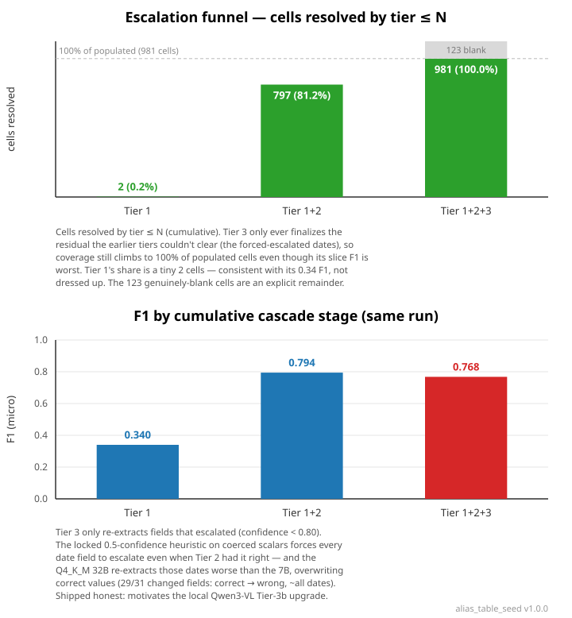
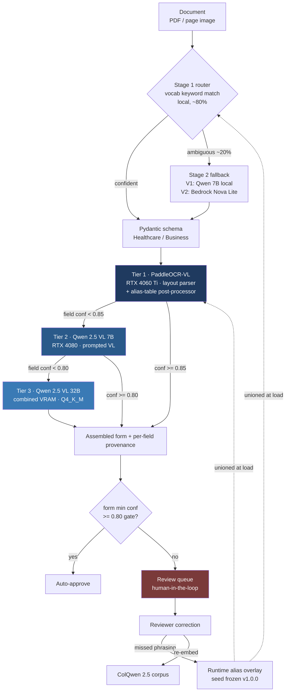

# intake-form-ai-pipeline

> ✅ **V1 complete.** A self-improving intake-form extraction pipeline that runs end-to-end, locally, on consumer GPUs — measured on a 92-document held-out test split, $0/1K inference, no cloud. **A cloud rebuild (V2) is a documented optional future enhancement, not active work:** its sole motivation is HIPAA — real PHI may only be processed through BAA-eligible providers, so the BAA-cloud cascade is the path a real-PHI deployment would take. The synthetic-data V1 needs no BAA and stands on its own as the portfolio deliverable. Last updated 2026-05-19.

## What it is

Forms come in as PDFs or page images — healthcare patient intake (CMS-1500), business documents (invoices, POs) — and validated, typed JSON comes out. A three-tier extraction cascade routes each field to the cheapest model that can handle it confidently and escalates only when confidence is low. Reviewer corrections feed back into an alias table and a ColQwen 2.5 retrieval corpus, so later extractions on similar documents resolve at Tier 1 more often.

V1 runs the entire cascade locally on two GPUs (RTX 4080 + RTX 4060 Ti, 32 GB combined) — no cloud, no deployed URL, $0/1K inference — and is the complete deliverable. The optional V2 enhancement exists for one reason: processing real PHI requires BAA-eligible providers, so V2 would swap the middle and top tiers for BAA-cloud services (Textract Queries, Bedrock) behind the *same* provider Protocol, wire the local tiers to a deployed endpoint, and stand up a public demo. The in-tree Terraform (`infra/terraform/`) and the architecture docs describe that target so it's a credible, scoped enhancement rather than hand-waving — but it is not built and not scheduled.

## The headline result



> **Measured on a 92-document held-out test split**, cached and deterministic ($0): the patient-level-stratified `test` partition of a 584-document local corpus (500 Synthea patients → CMS-1500, rendered 1:1; `train` 394 / `dev` 98 / `test` 92, zero patient leakage). Both panels are the same cascade run.

The interesting part of this project is not that a curve goes up. It's that measurement contradicted the pitch and the repo reports the contradiction.

**The cascade is not monotone.** Ablating it tier-by-tier (lower panel): Tier 1 → 0.340, Tier 1+2 → **0.794**, Tier 1+2+3 → **0.768**. The Qwen 7B Tier 2 does the real lift; adding the Q4_K_M-quantized 32B Tier 3 *regresses* −0.026. Tier 3 only ever re-extracts the fields that escalated (confidence < 0.80), and the locked 0.5-confidence heuristic on coerced scalars forces every date field below that gate even when Tier 2 had it right — so the quantized 32B re-extracts those dates and overwrites correct values (29 of 31 changed fields go correct → wrong, nearly all dates). It ships as-is rather than engineered monotone; a better (unquantized, reasoning) local Tier-3b is the *measured* lever to fix it, not a framing change.

What *does* rise monotonically is the **escalation funnel** (upper panel): cumulative cells resolved by tier ≤ N climb to 100% of the populated cells (2 → 797 → 981), because Tier 3 still finalizes the residual the earlier tiers couldn't clear — its slice F1 is the worst while coverage stays complete. Both readings are honest and both are shown; the 123 genuinely-blank cells are an explicit remainder, not hidden in the denominator.

The second contradiction is the self-improvement story. The pre-build pitch was "end-to-end F1 climbs as the correction loop runs." Phase 6 measurement showed that's false for a cascade with strong escalation tiers, and the 92-document split confirms it at scale: **end-to-end cascade F1 is flat at ≈0.77**, invariant to alias coverage, because the Qwen tiers recover whatever the alias layer missed. What alias growth actually buys is a higher Tier-1 *hit rate* — the Tier-1-stage F1 climbs 0.242 → 0.340 as more on-form labels are recognized (Tier 1 alias-matches ≥1 field on 91/92 docs; the router resolves 91/92 at Stage 1, classifies 92/92 correctly). It does *not* measurably reduce escalation count: at the locked 0.85 gate the escalation rate is corpus-flat at ≈0.998 (Tier 1's confidence model keeps populated cells below the gate regardless), so escalation-as-cost is a V2 property, not a V1 measured trend. The defensible claim is that measured Tier-1 curve, not the pitch. `docs/eval-methodology.md` has the full two-stage finding, the progressive-alias-partition mechanism, and the F1-over-time curve.

That posture — measure honestly, publish what you find, build the guardrails that keep the published artifact from drifting — runs through the whole project.

## How it works



A two-stage router classifies the vertical: a deterministic local vocabulary match handles ~80% of documents with no network hop, and only the ambiguous remainder hits an LLM fallback (local Qwen 7B in V1, Bedrock Nova Lite in V2 — one provider swap, identical routing logic above it). The chosen Pydantic schema seeds the cascade.

An in-process Python orchestrator (no state machine in V1; V2 wraps it in Step Functions) runs the tiers. PaddleOCR-VL is a layout parser whose blocks run through an alias-table-driven layout-to-fields post-processor; fields below the 0.85 threshold escalate to a prompted Qwen 2.5 VL 7B, then to Qwen 2.5 VL 32B below 0.80. Cheap fields settle at Tier 1 in sub-second-per-page; only the fields Tier 1 can't resolve pay GPU time higher up. The assembled form's minimum confidence decides auto-approval versus the human review queue. A reviewer's correction writes back with full provenance, appends any missed label phrasing to a runtime alias overlay, and re-embeds the document into the ColQwen corpus — so the next similar document resolves earlier.

The whole system persists to one SQLite file (extracted fields, eval log, ColQwen multivectors), intentionally Aurora-compatible so the V2 migration is a row-copy rather than a redesign. `docs/architecture-deep-dive.md` covers the orchestrator, persistence model, and the optional enhancement's cloud edge.

## What's worth a closer look

**The economics.** V1's cost is $0/1K — local inference on owned hardware, where latency is the meaningful metric, not dollars. The cost-routing argument is what the optional BAA-cloud enhancement would realize: BAA-cloud tiers in the middle and top would take the cascade to ~$9.50/1K, ~32× cheaper than putting every field through a single frontier model (~$300/1K at typical densities). V1 is not a prototype waiting on that number — it is complete, and it produces the measured escalation rates that make the projection credible rather than hypothetical.

**The integrity guardrails.** `alias_table_seed.json` is frozen at v1.0.0 because it's what the F1 chart plots from; live corrections accumulate in a gitignored overlay unioned onto the seed at load time, and the progressive-partition sweep explicitly *suppresses* that overlay so the published chart can never silently drift. The eval harness defaults to cached, deterministic, $0 fixtures with a CI drift-guard on the committed SVG; live provider runs are opt-in behind `EVAL_LIVE`. Phase 9's QLoRA experiment reports a `+0.0000` delta because the manifest leakage guard correctly yields zero non-leaky training pairs at committed scale — the honest result, not a hidden one.

**The consumer-hardware reality.** Tier 3's locked higher-precision plan (a Mungert Q8_0/Q6_K import) turned out infeasible on 31.2 GB of usable VRAM — Q8_0 spills, Q6_K hits an open llama.cpp M-RoPE assert. V1 ships the registry Q4_K_M build, the only configuration that runs, and documents the measured accuracy cost (≈0.77 on a 20-doc cross-vertical check) as a trade-off rather than burying it. `docs/local-development.md` has the full empirical decision.

**HIPAA as a deployment posture.** The V2 provider surface is BAA-eligible by design, so `HIPAA_MODE` is a startup-time assertion plus raised audit verbosity — not a parallel codebase or a provider-routing fork. V1's flag is a no-op (synthetic data only, no cloud routing surface). `docs/hipaa-architecture.md` covers the V2 BAA boundary.

## Honest results, stated plainly

- **Flat cascade F1 ≈0.78** is the robustness result, not a defect — escalation compensates for alias misses.
- **Phase 9 QLoRA delta is `+0.0000` at committed scale, by design** — the leakage guard working as intended; the reproducible pipeline and harness are the deliverable, and "QLoRA doesn't move the needle at portfolio scale" is itself a credible finding.
- **The review queue is populated by design** — the locked confidence heuristic scores a coerced date/int/float/bool field at 0.5, under the 0.80 gate, so any such form reaches a human. The demo presents this as the intended human-in-the-loop surface.

## Running it

```bash
git clone https://github.com/marky224/intake-form-ai-pipeline
cd intake-form-ai-pipeline
just install        # uv sync + pre-commit
just test           # 1077 tests (1058 fast + 19 slow)
just lint           # ruff + ruff-format + black

just demo           # Streamlit on :8501 — real 3-tier cascade over the
                    # 92-doc test split via cached replay. $0, no GPU.
```


The demo surfaces, per document: the rendered form, routed vertical and final tier, per-tier escalations, the per-field value/confidence/tier table, the populated review queue, and — as the headline analytics — the **by-stage ablation + escalation funnel** (the honest non-monotone F1 `0.340 → 0.794 → 0.768` shown beside the monotone *cells-resolved* coverage rising to 100%, both from the same cached run) with the supporting two-stage F1 chart below it. For live on-GPU inference, `ollama pull qwen2.5vl:7b qwen2.5vl:32b`, install PaddleOCR-VL per `docs/local-development.md`, then `EVAL_LIVE=true just demo`. No cloud calls, no AWS credentials, either way. `just eval` / `chart` / `by-stage` run the harness and regenerate the CI-drift-guarded SVGs; full task list in the `justfile`.

## Project structure

```
intake-form-ai-pipeline/
├── intake_schemas.py        # Pydantic v2 schemas (canonical artifact)
├── build_alias_seed.py      # regenerates alias_table_seed.json
├── alias_table_seed.json    # 465 aliases / 86 records, frozen v1.0.0
├── cascade/                 # provider Protocol, tier1/2/3, orchestrator, router, store
│   └── providers/           # tier1_paddleocr_local, tier2_qwen_7b_local, tier3_qwen_32b_local
├── evals/                   # F1/latency metrics, manifest, progressive alias partition, chart
├── rag/                     # ColQwen 2.5 retrieval + correction feedback loop
├── finetune/                # QLoRA text post-corrector (Phase 9 experiment)
├── demo/                    # Streamlit: data.py (testable core) + app.py (view)
├── synthetic_data/          # synthea/, render/ (Playwright CMS-1500), docile/
├── infra/                   # terraform/ (optional-enhancement target; bootstrap live) + bicep/ (no-deploy parallel)
├── tests/                   # 1077 tests + fixtures/ (eval-cache, eval-validation, synthea, docile)
└── docs/                    # architecture-deep-dive, hipaa-architecture, eval-methodology,
                             #   production-roadmap, local-development
```

Python 3.11+, Pydantic v2, `uv`, pytest, ruff + black, pre-commit from Phase 1. GitHub Actions runs four required checks on every PR — Lint, Test, Secret scan (gitleaks), IaC scan (checkov against the in-tree Terraform).

## Scope boundaries

V1 has no deployed demo URL and no cloud cascade tiers — local Streamlit only; the BAA-cloud Textract / Bedrock tiers belong to the optional V2 enhancement, which is documented but not built. No real PHI ever enters the system (Synthea synthetic data only) — which is also *why* V1 needs no BAA and is complete as-is. This is extraction, not a production claims-processing system; not multi-tenant SaaS; English only; no SOC 2 / HITRUST audits (the V2 enhancement is HIPAA-mode-*capable* by design; certification is out of scope either way). The Phase 9 QLoRA adapter demonstrates the feedback loop and is not a productized model.

## Further reading

- **`docs/architecture-deep-dive.md`** — the shipped V1 orchestrator + persistence; the optional enhancement's cloud edge, five-tier routing, Step Functions layout, sequence diagrams
- **`docs/eval-methodology.md`** — F1 computation, partition/leakage discipline, progressive alias partition, the two-stage finding, the by-stage ablation, Phase 8/9 deviations
- **`docs/hipaa-architecture.md`** — *why the optional cloud enhancement exists*: the BAA boundary, three-layer enforcement, the real-PHI swap path
- **`docs/production-roadmap.md`** — the one optional future enhancement (BAA-cloud for real PHI) + considered-not-done items (Qwen3-VL mixed-precision, Spanish, vLLM scale-up, Bedrock adapter import)
- **`docs/local-development.md`** — GPU/Ollama setup, multi-GPU split, the Tier 3 Q4_K_M trade-off, Synthea + DocILE workflows
- **`RATIONALE.md`** — schema design rationale (DataClass enum, ExtractedField wrapper, SignatureCapture, BoundingBox, confidence aggregation)
