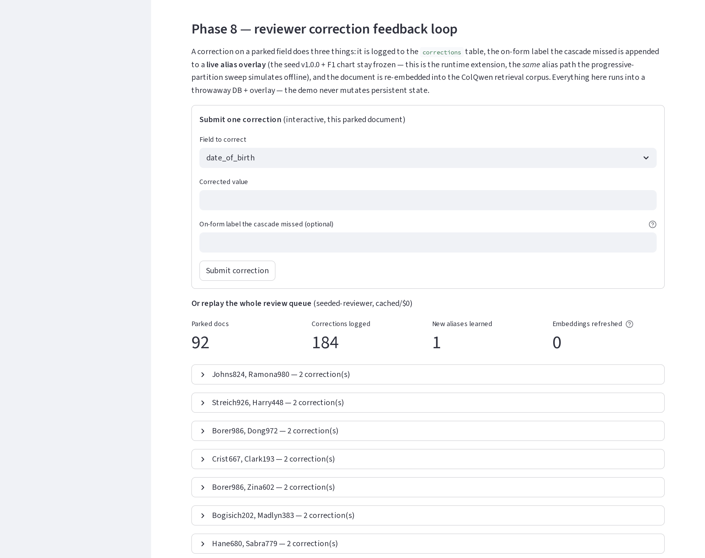

# Evaluation methodology

The eval harness is the project's measurement instrument. It produces three numbers per batch — F1, cost-per-document, and latency p50/p99 — across a partitioned document corpus. F1 is the headline metric; the README's headline visual is the **by-stage ablation + escalation funnel** (`docs/assets/f1-by-stage.svg`, the honest non-monotone cascade result), with the F1-over-time self-improvement chart and the full two-stage finding documented here in this methodology doc. The other two numbers are secondary signals showing that self-improvement reduces cost and latency in lockstep with accuracy gains.

This document covers how those numbers are computed, where the corpus comes from, how the partitions prevent train/test leakage, and the progressive alias-table mechanism that makes the F1-over-time chart move.

## Metrics

### F1

F1 is computed at the field level across all extracted forms in the eval batch. For each form, every populated `ExtractedField` is compared to ground truth:

- **True positive:** populated field whose extracted value matches ground truth (exact match for structured fields like dates and SSN; normalized string comparison for free-text fields after lowercasing and whitespace collapse)
- **False positive:** populated field whose value does not match ground truth, *or* a populated field that should have been blank (extracted ghost values)
- **False negative:** ground-truth value present, extraction returned None or returned a wrong value

F1 = 2 × precision × recall / (precision + recall), micro-averaged across all field-level (TP, FP, FN) counts in the batch. Per-vertical and per-field-type F1 breakdowns are also computed for diagnostic use; the headline number on the README is the micro-averaged F1 across the full eval test partition.

Confidently-blank fields — `value=None` with `tier_used` set, indicating the cascade affirmatively determined no value was present — are excluded from precision/recall. They are tracked separately for the reviewer UI but do not penalize F1.

### Cost per document

Cost per document is actual inference spend divided by document count, computed from per-call telemetry written to the eval-results store (SQLite in V1, Aurora in V2) during cascade execution. Provider rates are versioned in `evals/cost_table.json` so cost numbers remain reproducible against a frozen pricing snapshot even as upstream pricing changes.

In cached-fixture mode (the default), cost per document is computed from the cached fixture's recorded provider/tier metadata, not from live calls. Live mode (`EVAL_LIVE=true`) pulls real provider invoices via the cost-tagging system on each cascade run.

**V1 cost-per-doc reads $0 for every document** — V1's cascade has no cloud-provider surface, so there's no inference spend to divide. The harness still emits the column for schema continuity, but **F1 is the only primary signal in V1**. There is deliberately no latency-over-time or escalation-over-time companion chart: cached replay is ~1 ms/doc regardless of tier (replay overhead, not wall-clock), and a live run is non-deterministic, so neither can be a committed CI-drift-guarded artifact the way the F1 SVGs are. The operational reading of self-improvement is the Tier-1 *hit rate*, and that *is* the F1-over-time curve itself (see *Two-stage measurement* below) — not a separate artifact. V1's measured escalation rates still make the optional BAA-cloud enhancement's cost projection credible — the harness can model "what this batch would have cost under the BAA-cloud cascade" by multiplying V1 escalation rates against `evals/cost_table.json`, which is the strongest cost-engineering signal a complete-as-local portfolio can carry; that is a one-off modeled number, not a charted trend.

### Latency p50/p99

Latency is wall-clock time from cascade entry to last-tier response, recorded per document. p50 and p99 are computed across the eval batch. The eval harness also breaks latency down by tier — how long each document spent in each tier — to help diagnose where time accumulates when escalation rates climb.

## Cached fixtures vs live mode

The eval harness defaults to cached fixtures. Rather than a parallel fixture store, it reuses the cascade's existing per-tier replay cache at `tests/fixtures/eval-cache/<provider>/<image_sha256>.json` (already populated for every committed document across all tiers + the router). `evals/fixtures_manifest.json` is a thin manifest pinning the alias-seed version, the per-provider model identities, and the document id list to that cache — it deliberately carries no per-run timestamp (the replay fixtures were generated in Phase 4, not per eval run, and it is a committed file).

This default exists for two different reasons in V1 vs the optional cloud enhancement. In a BAA-cloud deployment, a single full eval batch through the live cascade would cost roughly $5–10 at current pricing (500–1000 docs at the ~$9.50/1K cascade rate; local-tier inference is essentially free, so live spend would be the cloud-tier portion only) — fine for explicit fixture-generation runs, ruinous if it accumulated accidentally across every CI run. In the complete V1 the spend is $0 across the board, but live mode still drives the Ollama models through full inference per document — slow wall-clock time (~30 s/doc for a deep Tier 3 escalation) compared to cached replay (~1 ms/doc). Cached mode reads fixtures from disk at full speed and produces deterministic F1 numbers; live mode produces slightly non-deterministic F1 because LLM responses have noise.

CI never runs in live mode (V1 or V2). Live runs require the `EVAL_LIVE=true` environment variable, set explicitly during local fixture-generation sessions. Phase 6 generates an initial fixture set against ~50 documents, sanity-checks F1, then expands to the full test partition. V1's "build budget" is wall-clock time rather than dollars — the small-testing-first discipline keeps fixture-generation runs to overnight rather than weekend-long. Were the optional BAA-cloud enhancement ever built, its build budget would return to the ~$30–50 envelope described in `docs/production-roadmap.md`.

## Partition discipline

`evals/manifest.json` partitions every document in the corpus into one of three sets:

- **train:** used for prompt engineering, threshold tuning during development, and Phase 9's QLoRA fine-tuning. Looking at these documents to inform extraction logic is allowed.
- **dev:** used for the Phase 5 router calibration spot-check (~50 hand-classified documents, roughly 25 healthcare + 25 business) and for sanity-checking changes before running test. Looking at these documents during development is allowed but should be rare.
- **test:** held out. The eval harness reports F1 on test only. Documents in test are never inspected during cascade development; threshold tuning never reads test.

The partition is stratified across verticals (healthcare and business documents both appear in all three splits at consistent ratios) and across document complexity (single-page forms, multi-page forms, rotation-corrected pages, and mostly-blank pages all appear proportionally in each split).

## Leakage mitigations

Two leakage paths exist in the synthetic + DocILE corpus and are addressed explicitly.

**Synthea patient leakage.** A single Synthea-generated patient produces multiple documents (different visit dates, different facility templates). If the same patient appears in both train and test, an extractor that memorized the patient's idiosyncratic data could appear to generalize when it has not. Partitioning is therefore done at the *patient* level, not the document level: every document for a given Synthea patient lands in the same partition. This is enforced in the partition-generation script by hashing on patient ID, not document ID.

**DocILE annotation leakage.** DocILE provides its own train/val/test split. The project's `evals/manifest.json` test partition for the business-documents vertical is a strict subset of DocILE's val + test (never DocILE's train). DocILE train is used for prompt examples and few-shot retrieval corpus seeding only — never as eval ground truth.

CI runs a partition-validation test that asserts no patient ID and no DocILE document ID appears in more than one of the three sets. The test runs in the standard CI suite on every PR; a partition-script edit that introduces leakage fails the build.

## Human-in-the-loop review queue

The review queue is the cascade's HITL surface — the *input* side of the self-improvement loop (the next section is what a human's correction then does). A field that is still below the 0.80 escalation gate after Tier 3 is exhausted is parked to the `review_queue` table (`cascade/store.py`) rather than silently accepted; the demo renders it under the "Human-in-the-loop review queue" heading with its per-tier error history.

**The queue is populated by design, not by failure.** The locked 0.5-confidence heuristic scores any *coerced* scalar (date / int / float / bool) at exactly 0.5 — below the 0.80 gate — even when the value is extracted correctly (see *Partition discipline* and the same heuristic in *By-stage ablation*). Every form with a date field therefore parks at least one field for review. A non-empty queue is the intended operating point of a cascade built around human adjudication, not an error rate to drive to zero; the heuristic and gate are frozen (Phase 5/6) and are deliberately *not* tuned to empty the queue.

**Measurement boundary (why this lives in the methodology doc).** Parking a field for review does **not** change its F1 contribution. F1 is computed over every populated `ExtractedField` against ground truth regardless of whether that field was also routed to `review_queue` — a wrong-but-parked value still counts as a false positive. This is the deliberate guard against the obvious gaming path: if "sent to review" excused a field from scoring, a cascade could inflate F1 simply by parking everything it was unsure of. The queue is operational triage layered on top of the metric, never a metric adjustment. This is distinct from the **confidently-blank exclusion** (see *Metrics → F1*): a `value=None`-with-`tier_used` field is excluded from precision/recall because there is nothing to score, whereas a parked *populated* field is fully scored — the two are different mechanisms and only the first touches the F1 denominator.

The coupling to self-improvement: the fields the queue surfaces are exactly the fields a reviewer corrects, and those corrections are what grow the alias overlay described next. The queue is the surface; the loop is the learning.

## The self-improving loop (component)

The self-improvement story has two halves: a **live runtime loop** (the component described here) and an **offline analogue** that measures it (the progressive alias-table sweep, next section). They share one mechanism — alias growth feeding the Tier 1 layout-to-fields post-processor and the Stage-1 router vocabulary — so the measured F1-over-time curve is a faithful proxy for the live loop, not a separate story.

The live loop runs in the demo's *reviewer correction feedback* surface. When a reviewer corrects a parked field, three things happen: (1) the correction is logged to the `corrections` table; (2) the on-form label the cascade missed is appended to a **live alias overlay** (`data/corrections_aliases.json`) — the frozen v1.0.0 seed and the committed F1 chart are never mutated, so the overlay is a pure runtime extension that the Tier 1 + router alias consumers union on top of the seed at load time, taking effect for the *next* extraction; (3) the document is re-embedded into the ColQwen retrieval corpus. In the portfolio demo there are no live reviewers, so corrections are *seeded* from the schema-design alias work and replayed — the mechanism is identical, only the source of corrections differs (stated plainly, not dressed up as live reviewer data). Every demo action runs against a throwaway DB + overlay; persistent state is never mutated.

The seeded replay over the committed 92-doc corpus logs **184 corrections** and learns **1 new alias** (most missed phrasings are already recognized at seed v1.0.0 — the loop never fabricates a phantom alias, so "new aliases learned" is honestly low). The crucial honest point, carried through from *Two-stage measurement*: this loop's measurable V1 payoff is the Tier-1 hit-rate climb, **not** a falling escalation count (escalation is corpus-flat at ≈0.998 — see above) and **not** an end-to-end F1 gain (the cascade is alias-invariant at 0.768). The loop is real and the mechanism is production-shaped; what V1 honestly claims for it is exactly the Tier-1 curve and no more.

## Progressive alias-table partition for F1-over-time

The F1-over-time chart demonstrates the cascade's self-improvement loop: as the alias table grows, fewer fields require escalation. (Since PR #71 the README's headline visual is the by-stage ablation + escalation funnel; the F1-over-time artifact, `just chart`, and its CI drift guard all remain live, and this is its full treatment.) It is still the most semantically loaded measurement in the repo.

### Two-stage measurement (Phase 6 finding — supersedes the naive model)

The pre-build mental model was "fewer recognized phrasings → more escalations → lower *end-to-end* F1; more phrasings → higher end-to-end F1." Phase 6 measurement on the committed corpus showed that model is wrong for a cascade with strong escalation tiers, and the honest result is documented here rather than the chart being engineered to fit the original story.

F1 is measured at **two stages** per alias batch:

- **Tier-1 stage** — the pre-escalation form (Tier 1 extract → route → re-parse). This is the layer the alias table directly governs. Its F1 climbs as alias coverage grows, then asymptotes — the desired shape, and **this is the plotted headline curve**.
- **Cascade stage** — the end-to-end assembled form after escalation. This F1 is **invariant to alias coverage** (flat at 0.768, identical across all nine alias batches on the 92-doc test split): the Qwen Tier 2/3 tiers are alias-independent and recover whatever the alias layer missed. It is persisted as a *cascade-robustness* statistic, not the headline curve.

The defensible self-improvement claim is therefore: the alias loop measurably improves the Tier-1 hit rate (more on-form labels are recognized, so more fields are correctly populated pre-escalation), and end-to-end accuracy is robust to alias coverage because the cascade compensates. The "Tier-1 hit rate" *is* the Tier-1-stage F1 curve — it is not a separate measurement and there is no separate chart for it. In V2 that same hit-rate gain reads directly as fewer escalations and therefore lower cost-per-document; in V1 it does not, and the honest reason is recorded below. The naive "end-to-end F1 climbs" framing is *not* claimed. Measured on the 92-document patient-stratified `test` split (of the 584-document local corpus), the Tier-1 curve is 0.242 → 0.340 — modest and asymptoting by the second batch — and the cascade stays flat at 0.768. The shape is identical to the original 6-document slice: it is a property of alias coverage and cascade architecture, not of corpus size.

**Escalation rate does not visibly move in V1 (measured, recorded honestly).** A natural follow-up question is whether the alias gain shows up as a *falling escalation rate* — fewer scorable cells crossing the locked 0.85 Tier-1→2 gate as coverage grows. It does not. Measured at the gate across all nine batches on the 92-doc `test` split, the Tier-1→2 escalation rate is **flat at ≈0.998** — essentially every populated cell escalates regardless of alias coverage. The mechanism: alias growth raises Tier-1 *correctness* (the fields land the right value, lifting F1) but Tier 1's layout-parser confidence model keeps those same populated cells below 0.85 anyway, and the locked 0.5-confidence heuristic on coerced scalars (dates) pins those below the gate unconditionally. So the alias loop's measurable payoff in V1 is the Tier-1 F1/hit-rate climb, *not* a reduced escalation count — and no escalation-over-time chart is shipped, because a flat 0.998 line plotted as a trend would be exactly the sleight-of-hand visual *Why position-based ordering* rejects. The escalation-as-cost story is real but it is a V2 property (where cloud tiers make escalation expensive); in V1 it is a modeled projection against `evals/cost_table.json`, not a measured curve.

### By-stage ablation (the cascade is not monotone)

The two-stage measurement above plots Tier-1-stage F1 over alias batches. A separate, orthogonal question is *what each tier contributes* — answered by ablating the cascade tier-by-tier on the same 92-doc `test` split, cached and deterministic. The committed artifact is `docs/assets/f1-by-stage.svg` — two panels (the escalation funnel on top, F1-by-cumulative-stage below), drift-guarded by `tests/test_evals_by_stage.py`, regenerated via `just by-stage`.

Three cumulative-stage F1 points:

| Stage | F1 | Construction |
|---|---|---|
| Tier 1 | **0.340** | `harness._tier1_stage_form` (Tier 1 extract → route → re-parse) |
| Tier 1+2 | **0.794** | `process_document(providers=(t1,t2,t2))` — Tier-3 slot duplicated as Tier 2, so a sub-0.80 escalation is just re-confirmed by the 7B; a faithful "Tier 3 disabled" ceiling without touching the frozen escalation logic |
| Tier 1+2+3 | **0.768** | the real `(t1,t2,t3)` cascade |

**The cascade is not monotone by tier: adding the Q4_K_M Tier 3 regresses −0.026.** The 7B Tier 2 does the real lift (0.340 → 0.794); the quantized 32B Tier 3 nets slightly worse than leaving the escalated fields at Tier 2. Mechanism, probed field-by-field: Tier 3 only ever re-extracts fields that escalated (confidence < 0.80). The locked 0.5-confidence heuristic on coerced scalars (date/int/float/bool — see *Partition discipline* and the Phase 5 review-queue rule) forces **every date field** below the 0.80 gate even when Tier 2 extracted it correctly, so every date escalates to Tier 3; the Q4_K_M 32B then re-extracts those dates worse than the 7B and overwrites the correct values. 29 of 31 changed fields are Tier 3 turning a correct value wrong, ≈all of them dates (`date_of_birth`, `date_signed`). This is the sharp form of the flat-cascade finding above, and it ships as-is under the honest-results gate — the locked 0.5-confidence heuristic and escalation predicate (Phase 5/6, frozen) are **not** altered to "fix" the dip. The sanctioned lever is a better Tier 3: the in-flight local Qwen3-VL Tier-3b (unquantized, reasoning) is the measured — not assumed — path to a monotone curve, and the chart updates if and only if that beats 0.794 honestly.

**Escalation funnel (top panel).** The same full `(t1,t2,t3)` run, counting each of the 1104 scorable cells (92 docs × 12 schema-mapped fields) by the tier that finally produced its value: Tier 1 **2**, Tier 2 **795**, Tier 3a **184**, genuinely blank **123**. Cumulative cells resolved by tier ≤ N — **2 → 797 → 981** — rises monotonically to 100% of the 981 populated cells, even though Tier 3's *slice* F1 is the worst. The two readings are consistent, not contradictory: Tier 3 only ever finalizes the 184-cell residual the earlier tiers couldn't clear (the forced-escalated dates), so coverage completes while that slice's accuracy is poor. Tier 1's funnel share is a deliberately undressed 2 cells — consistent with its 0.340 F1, not inflated. The 123 genuinely-blank cells (no value on the source form — true negatives) are drawn as an explicit remainder above the 100% line, not hidden in the denominator.

### Router spot-check (and a documented V1 limitation)

The Stage-1 router was spot-checked on the broad set: all **92/92** CMS-1500 `test`-split docs classify `healthcare`, **91/92 (98.9%)** on distinctive vocabulary alone at Stage 1 (the one fallthrough still resolves correctly via Stage 2), so `N = 1.0` holds with margin on the positive class.

The negative class is weak, and the repo says so. A 50-document local-only DocILE spot-check (business invoices — these *should* route `business`) scores **business_rate 0.46**: 27/50 are false-positively classified `healthcare`. This is a real V1 limitation, not noise. V1's Stage 1 is a deliberately **one-sided healthcare-distinctive-vocabulary gate** — there is no business-distinctive vocabulary and no business gate, so any document whose OCR trips enough healthcare-ish aliases to score ≥ `N` is classified `healthcare` immediately, never reaching the Stage-2 LLM. `N = 1.0` was only ever tuned on healthcare documents. The honest consequence: a business document that trips the healthcare gate is extracted against the wrong schema. A business-distinctive gate (and an `N` re-tuned against a cloud routing table) is exactly the kind of refinement the optional BAA-cloud enhancement would carry; the complete V1 ships the measured limitation rather than hiding it (DocILE derivatives are CC-BY-NC-ND, so this number is reported here but the spot-check itself stays local).

In production with real reviewers, the loop runs continuously — corrections write back to the alias table, and subsequent batches benefit. In this portfolio demo there are no live reviewers, so the corrections feeding the loop are seeded from the schema-design alias work rather than reviewer-generated. The mechanism is identical; only the source of corrections differs. This is documented honestly in the README rather than dressed up as live reviewer data.

### Partition mechanism

`alias_table_seed.json` (~465 aliases across 86 records as of seed v1.0.0) is partitioned into batches by per-record alias position. Batch N includes positions 0 through N–1 of every record's `aliases` array.

Concrete batch math against the current seed:

| Batch | Positions included | Approx alias count | % of total |
|------:|:------------------|-------------------:|-----------:|
| 1     | 0                 | ~86                | ~18%       |
| 2     | 0–1               | ~170               | ~37%       |
| 3     | 0–2               | ~250               | ~54%       |
| 4     | 0–3               | ~330               | ~71%       |
| 5     | 0–4               | ~395               | ~85%       |
| 6     | 0–5               | ~440               | ~95%       |
| 7     | 0–6               | ~460               | ~99%       |
| 8     | all               | 465                | 100%       |

Records with fewer aliases than the current batch index contribute their full list and no further. The exact alias counts above will drift as the seed evolves; the partition definition — "Batch N includes positions 0 through N–1 of every record's `aliases` array" — is the stable contract.

The natural batch count is around 8 given the current seed (the longest `aliases` lists have 8 entries). The chart plateaus naturally as later batches add fewer marginal aliases, which is the desired shape — F1 should climb sharply early, then asymptote.

### Why position-based ordering

The `aliases` arrays in `build_alias_seed.py` are hand-curated in priority order. Position 0 is the canonical/authoritative phrasing for each field, typically the exact label from the source standard (CMS-1500, ACORD 125, USCIS I-9, IRS W-4, etc.). Subsequent positions are variants in rough decreasing real-world frequency — not a measured frequency, but a curator's judgment informed by inspection of dozens of real forms.

For hand-curated taxonomies, canonical priority and real-world frequency are heavily correlated. A field's canonical label is canonical *because* most forms use it. Position-based introduction is therefore a cheap, reproducible proxy for frequency-based introduction without requiring corpus-derived frequency counts.

Three alternatives were considered and rejected.

**Measured frequency from the rendered corpus** would be the most rigorous option but breaks down on synthetic data. Frequency in the Synthea + DocILE corpus is determined by the rendering templates and DocILE's source distribution, not by real-world prevalence on intake forms in the wild. Measuring template diversity and calling it "alias frequency" misrepresents what is being computed. If a CMS-1500 template uses "Patient Name" exclusively, then "Patient's Name" has frequency 0 in the corpus regardless of how common it is on real intake forms — the measurement reflects the template author's choices, not the field's actual prevalence.

**Source-standard priority** (introducing all aliases from records with a `source_standard` value first, then the rest) partitions records but does not graduate aliases. About 50% of seed records have a `source_standard` value, so this approach produces one big batch and one big "everything else" — a step function, not a curve, and the chart loses its expressive power.

**Random with fixed seed** is reproducible but tells no story. A chart that climbs because of randomness is not a meaningful self-improvement narrative; it is a sleight-of-hand visual that would invite legitimate skepticism from anyone reading the code.

### Reproducibility

The partition is deterministic given a frozen seed. `alias_table_seed.json`'s top-level `version` field (currently `"1.0.0"`) is recorded in `evals/fixtures_manifest.json` and in `evals/manifest.json` (the partition-validation CI test asserts the two agree, so a seed bump that isn't propagated fails the build). F1-over-time runs against a given fixture set are directly comparable only to runs against the same seed version — comparing across seed versions requires regenerating the chart from scratch.

When seed v2.0.0 ships (e.g., from Phase 8 correction feedback adding new aliases, or from a deliberate reordering of existing aliases in light of new evidence), the F1-over-time chart can be regenerated against the new seed for that version's self-improvement curve. The v1.0.0 chart is not backward-extended. The README documents whichever version produced the live chart.

### Phase 8 implication (shipped)

The Phase 8 correction feedback loop introduces new aliases from reviewer corrections. As shipped, those aliases are **not** written into `alias_table_seed.json` — the seed is frozen at v1.0.0 (it is what the F1-over-time chart is plotted from), and an in-place edit would silently alter the chart. Instead a reviewer correction appends the missed phrasing to a gitignored runtime overlay (`data/corrections_aliases.json`, same runtime-state convention as `data/v1.db`). The two alias consumers — the Tier 1 layout-to-fields post-processor and the Stage 1 router vocabulary — union the overlay on top of the seed at load time, so live corrections take effect immediately for subsequent extractions.

The progressive-partition sweep explicitly **suppresses** the overlay (`rag.aliases.suppress_overlay`, entered by `evals.alias_partition.active_alias_batch`): the F1-over-time chart is the *offline analogue* of the loop and must reflect the v1.0.0 seed alone, so runtime corrections never leak into it. The live loop and the offline analogue therefore share one mechanism (alias growth → Tier 1 + router) while the measured artifact stays honest — this is the "seeded vs. live, identical mechanism" claim made concrete in code.

A genuine reseed — promoting a variant to an earlier position, or folding accumulated overlay corrections into the canonical seed — remains a deliberate **v2.0.0 seed bump**, not an in-place edit to v1.0.0, and the version bump is still the explicit signal to regenerate the chart from scratch (per the `build_alias_seed.py` position convention).

### Phase 8 storage + scope deviations (recorded honestly)

Two deliberate deviations from the originally-locked Phase 8 design, documented rather than silently followed:

1. **Embedding storage.** `architecture-locked.md` named `sqlite-vec`. ColQwen 2.5 is a *late-interaction multivector* retriever (one matrix of per-patch token vectors per document, scored by ColBERT MaxSim); `sqlite-vec`'s `vec0` is single-vector KNN and cannot express late interaction. Honoring the literal lock would force a lossy mean-pool that defeats the point of choosing a late-interaction model, while adding a dependency that buys nothing at the V1 corpus scale (6–500 documents) where the exact NumPy MaxSim scan is microseconds. V1 instead packs the multivector into the **reserved `embeddings.vector` BLOB column** (Phase 5 reserved it for exactly this — so Phase 8 is reads/writes, **no schema migration**) and ranks with brute-force MaxSim. V2's pgvector path is unaffected.

2. **Retrieval scope.** The README describes the production mechanism in which the retrieved corrected document is injected as a few-shot example into the Tier 2 + Tier 3 prompts. V1 builds and *surfaces* the late-interaction retrieval (the demo shows each parked document's nearest corrected neighbors) but does **not** wire that injection into the cascade providers: changing the providers' prompts would invalidate the committed replay-cache fixtures and the frozen two-stage F1 artifact, which Phase 8 must leave untouched. The alias-overlay half of the loop is the part that genuinely affects V1 extraction; the few-shot-injection half is V2's deployed pipeline.

### Phase 9 — QLoRA experiment measurement (honest at portfolio scale)

Phase 9 fine-tunes a text post-corrector (Qwen2.5-7B QLoRA — not the plan's nonexistent "Llama 3.1 13B"; not a VL Tier-2 swap, since the `corrections` corpus is text-only) and measures it through the **existing** `score_form` over the **same** `test` partition the cascade-stage F1 uses — the post-correction number is therefore directly comparable to the Phase 6 cascade-stage F1, by construction (the metric is reused, not re-implemented; `finetune.evaluate` reproduces the 0.768 cascade-stage baseline as a regression check).

The training data is split-partitioned by `evals/manifest.json`: pairs are built **only** from `train` documents *that carry `seeded_correction` corrections*. The 584-document corpus now populates `train` (394 docs), but the **corrections corpus itself is the deferred local piece** — no reviewer/correction data is committed (the committed eval set is the 92-doc `test` split only), so the experiment still honestly produces **0 non-leaky training pairs** and the eval reports an **identity baseline (delta 0.000)**. This is the leakage guard working as designed, not a gap: training a corrector on the eval documents would be the dishonest version of this experiment. The reproducible pipeline + harness are the V1 deliverable; the real F1 delta requires a GPU-box `FINETUNE_LIVE` run over the deferred local corrections corpus (the separate Phase 9 live-train follow-up). A leakage-safe synthetic format-normalization set (`source: synthetic_format_kind`, no test-document values) lets the QLoRA pipeline run end-to-end on the GPU box and keeps the unit tests meaningful; it is explicitly *pipeline smoke*, never reported as correction signal. Consistent with Phase 6/7/8, this seeded-vs-live distinction is documented plainly rather than dressed up.

## Operational notes

The eval harness is invoked via `just eval` (cached fixtures) or `just eval-live` (live cloud calls, opt-in only). Both commands write results to `evals/results/` keyed on a UTC timestamp + git short SHA + seed version. Historical results are gitignored — they regenerate deterministically from the fixture set and seed.

The static SVG F1-over-time chart is generated by `just chart`, which reads from `evals/results/` and emits `docs/assets/f1-over-time.svg` (the README's headline visual is the by-stage chart since PR #71; this artifact and its guard stay live regardless). It reflects real data — a cached Tier-1 sweep over the 92-doc committed CMS-1500 `test` split against the frozen v1.0.0 seed — and a CI drift guard (`test_evals_chart.py`) fails the build if the committed SVG diverges from a fresh re-render, so it cannot silently go stale. The chart is deterministic from the fixture set + seed; regenerating it produces identical bytes unless the seed or fixtures change. The optional BAA-cloud enhancement would additionally wire this same SVG into the wake-page shown during Aurora cold-start.
